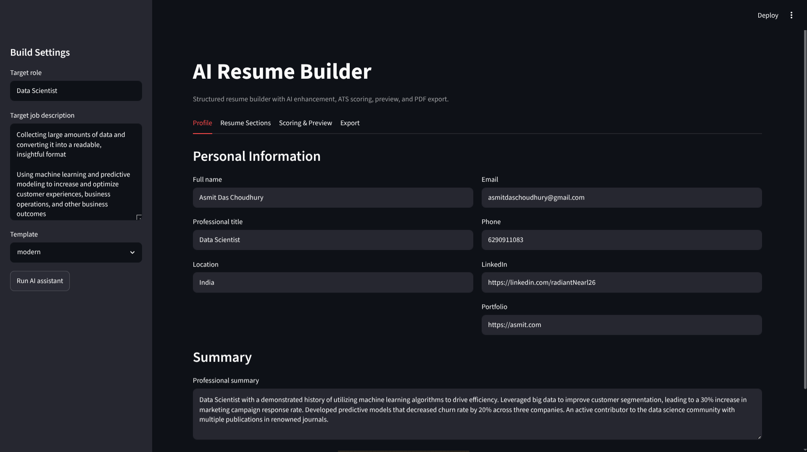
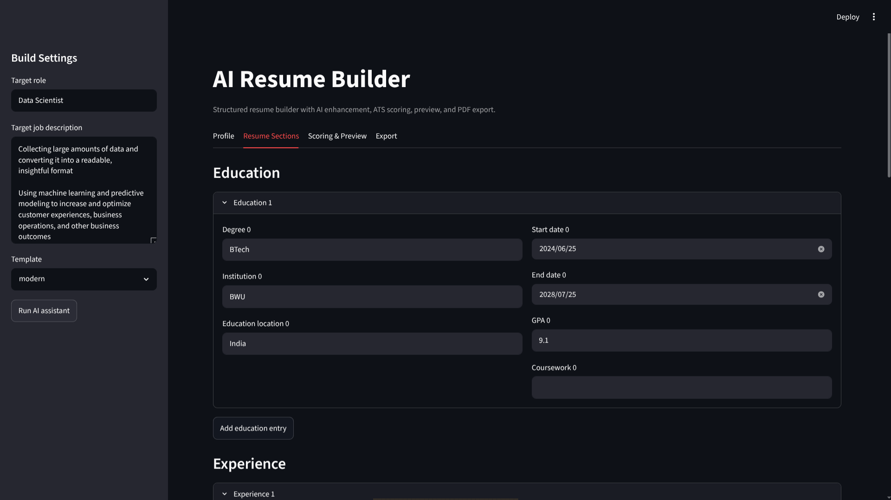
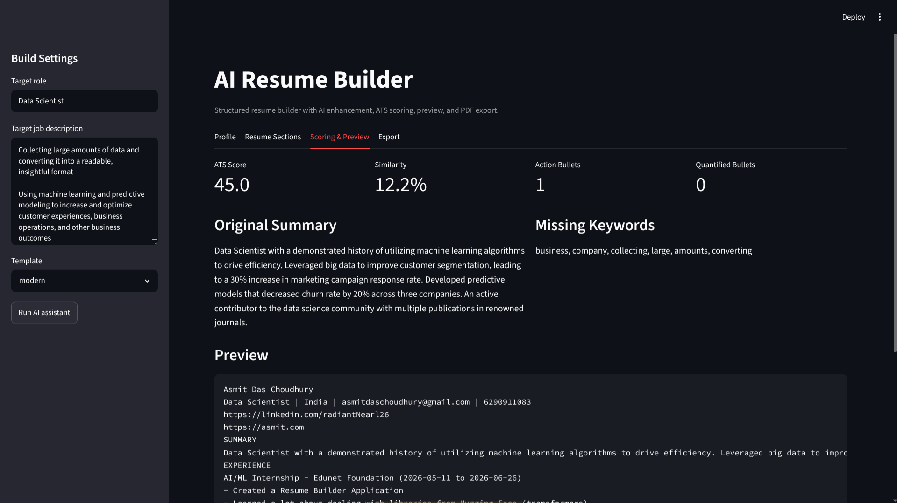
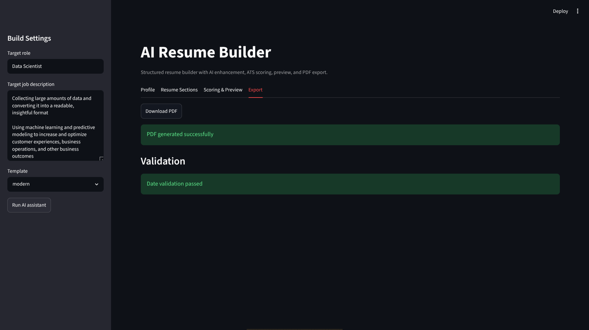

<div align="center">

</div>

<div align="center">

# AI Resume Builder

[Python](https://img.shields.io/badge/Python-3.10+-3776AB?style=for-the-badge&logo=python&logoColor=white)

[Streamlit](https://img.shields.io/badge/Streamlit-FF4B4B?style=for-the-badge&logo=streamlit&logoColor=white)

[Internship](https://img.shields.io/badge/IBM_SkillsBuild-052FAD?style=for-the-badge&logo=ibm&logoColor=white)

[License](https://img.shields.io/badge/License-MIT-green?style=for-the-badge)

**AI-assisted resume builder that collects structured profile data, improves content, scores JD relevance, and exports polished PDFs.**

_Built during AI/ML Internship with Edunet Foundation, supported by IBM SkillsBuild_

[Overview](#-overview) • [Features](#-features) • [Architecture](#-system-architecture) • [Technologies](#-technologies-used) • [Screenshots](#-screenshots) • [Structure](#-project-structure) • [Installation](#️-installation)

</div>

## 🚀 Overview

> [!NOTE]
> 🏆 Built as the capstone project for the **IBM SkillsBuild AI/ML Internship** in partnership with **Edunet Foundation**

This is a Streamlit web application that helps users build better resumes using a guided section-based form. It validates resume input, suggests stronger summaries and experience bullets, computes ATS-style quality and job-match metrics, and generates export-ready PDF resumes.

### Problem Statement

Many students and early-career professionals struggle to present skills and project impact in a recruiter-friendly format. Generic templates often miss role-specific keywords and measurable outcomes, which reduces interview conversion and ATS compatibility.

### Proposed Solution

This project provides an end-to-end resume workflow: structured data intake, schema validation, AI-assisted rewriting, job-description keyword gap analysis, ATS-style scoring, and one-click PDF export. The system improves resume clarity and relevance while keeping user control over final edits.

## 🪄 Features

> [!NOTE]
> The app works with a local enhancement fallback and optionally supports API-key-driven LLM integration via `.env`.

| Feature                         | Description                                                                |
| ------------------------------- | -------------------------------------------------------------------------- |
| 🧾 **Structured Resume Form**   | Collects personal info, summary, education, experience, skills, and more.  |
| ✨ **AI-Assisted Rewriting**    | Improves summaries and bullet phrasing for stronger impact language.       |
| 🎯 **Job Description Matching** | Compares resume content against target JD keywords and similarity signals. |
| 📊 **ATS-Style Scoring**        | Produces heuristic ATS quality metrics to guide resume improvements.       |
| 📄 **PDF Export**               | Exports a polished resume PDF from the validated structured profile.       |

## 🧠 System Architecture

> [!NOTE]
> The architecture follows a modular pipeline: UI intake, validation, AI enhancement, scoring, preview, and export.

```text
┌─────────────────────────────────────────────────────────────┐
│                         UI LAYER                            │
│                 Streamlit Multi-Section Forms               │
└──────────────────────────┬──────────────────────────────────┘
                           │
                           ▼
┌─────────────────────────────────────────────────────────────┐
│                   APPLICATION ORCHESTRATION                 │
│            Session State │ Data Parsing │ Flow Control      │
└──────────────────────────┬──────────────────────────────────┘
                           │
                           ▼
┌─────────────────────────────────────────────────────────────┐
│                    DATA MODEL & VALIDATION                  │
│        Pydantic Resume Schema │ Date & Field Validators     │
└──────────────────────────┬──────────────────────────────────┘
                           │
                           ▼
┌─────────────────────────────────────────────────────────────┐
│                     AI / NLP ENHANCEMENT                    │
│ Summary Rewrite │ Bullet Enhancement │ Keyword Extraction   │
└──────────────────────────┬──────────────────────────────────┘
                           │
                           ▼
┌─────────────────────────────────────────────────────────────┐
│                         SCORING LAYER                       │
│      TF-IDF Similarity │ ATS Heuristics │ Keyword Gaps      │
└──────────────────────────┬──────────────────────────────────┘
                           │
                           ▼
┌─────────────────────────────────────────────────────────────┐
│                      PREVIEW & EXPORT                       │
│              Resume Preview │ ReportLab PDF Output          │
└─────────────────────────────────────────────────────────────┘
```

## 🧑‍💻 Technologies Used

> [CAUTION]
> Ensure that the libraries are installed. requirements.txt file is also provded.

### Core

| Library         | Purpose                                     |
| --------------- | ------------------------------------------- |
| `Python 3.10+`  | Core language                               |
| `Streamlit`     | Web UI and interactive form-driven workflow |
| `pydantic`      | Strong schema validation for resume data    |
| `python-dotenv` | Environment variable loading from `.env`    |

### NLP & Machine Learning

| Library        | Purpose                                          |
| -------------- | ------------------------------------------------ |
| `scikit-learn` | TF-IDF vectorization and similarity scoring      |
| `numpy`        | Numerical support for score calculations         |
| `reportlab`    | Programmatic PDF resume generation               |
| `pytest`       | Unit testing for validators, scoring, and export |

## 📷 Screenshots






---

## 📁 Project Structure

> [!NOTE]
> Modular package layout for easier extension and testing.

```
resume-builder-edunet/
│
├── app/
│   └── main.py                  # Streamlit application entrypoint
│
├── ai_resume_builder/
│   ├── core/
│   │   ├── config.py            # Environment/config loading
│   │   ├── constants.py         # Shared constants
│   │   ├── schemas.py           # Pydantic resume schema
│   │   └── validators.py        # Validation helpers
│   │
│   ├── services/
│   │   ├── llm_service.py       # AI enhancement logic + fallback
│   │   ├── resume_builder.py    # Resume text assembly/orchestration
│   │   └── scoring_service.py   # ATS and JD match scoring
│   │
│   ├── export/
│   │   └── pdf_reportlab.py     # PDF export implementation
│   │
│   └── utils/
│       └── text_cleaning.py     # Text normalization helpers
│
├── tests/
│   ├── test_export_pdf.py
│   ├── test_scoring.py
│   └── test_validators.py
│
├── requirements.txt             # Python dependencies
├── pyproject.toml               # Project metadata and pytest config
├── .env.example                 # Environment variable template
└── ai-resume.md                 # Implementation guide followed for this app
```

## 🖱️ Installation

> [!IMPORTANT]
> Install conda and Python 3.10+ before proceeding. Otherwise, use a virtual environment with pip.

### Prerequisites

- `Python` 3.10+
- `pip` package manager
- `conda` (optional but recommended)

### 1. Clone the repository

```bash
git clone https://github.com/radiantNearl26/resume-builder-edunet.git
cd resume-builder-edunet
```

### 2. Setup conda environment and actvate it

```bash
conda env create -n resume-env -f requirements.txt
conda activate resume-env
```

### 3. Use PIP (alternative)

```bash
pip install -r requirements.txt
```

### 4. Run the app

```bash
streamlit run app/main.py
```

### 5. Run tests

```bash
pytest
```

## 🎯 Room for Improvement

Features to add / Things to fix:

- [x] Structured form-based resume intake
- [x] AI/NLP-assisted summary and bullet enhancement
- [x] ATS-style scoring and keyword gap analysis
- [x] PDF export
- [ ] Template theme customization in export
- [ ] Save/load resume profiles from storage
- [ ] Rich side-by-side original vs improved diff view

## Contributing

If you'd like to contribute to these dotfiles, please feel free to submit a pull request or open an issue to discuss changes and proceed with the usual procedure. In case of any issues or troubles, feel free to check out the [`CONTRIBUTING`](./CONTRIBUTING.md) file or reach out to me via email or DMs.

## License

These dotfiles are released under the BSD 2-Clause "Simplified" License. See the [`LICENSE`](./LICENSE) file for details.
